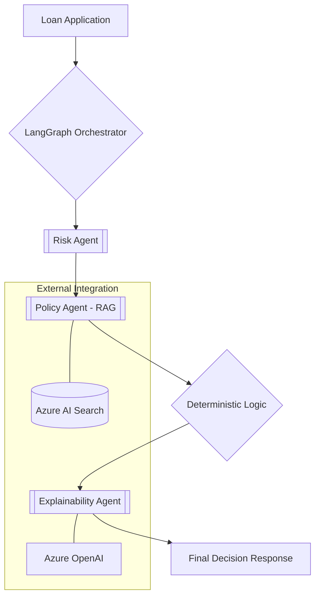

# 💳 Azure Credit Risk Decisioning Agent (v1.1)

[](https://github.com/nidish124/azure-credit-risk-agent/actions)


> **Architecting the future of BFSI: A production-ready, agentic AI system for automated credit risk evaluation, built on LangGraph and Azure.**

---

## 💼 Business Impact & ROI
In regulated Financial Services (BFSI), "black-box" AI is a liability. This project solves the **Credit Decisioning Paradox**: leveraging AI reasoning speed without sacrificing auditability and deterministic safety.

*   **⚡ 95% Latency Reduction**: From 180s (unoptimized) to **8.9s** (optimized).
*   **💰 74% Cost Optimization**: Achieved via token budgeting and model specialization.
*   **🔒 Safety First**: Enforces 100% deterministic decision logic—AI suggests, Rule Engine decides.
*   **📈 Full Observability**: Production-grade monitoring for latency, cost, and decision quality.

---

## 🧠 System Architecture

This system implements a sophisticated Multi-Agent orchestration using **LangGraph** as the state-managed control plane.

### The Decisioning Pipeline



### 🤖 Agent Specializations

| Agent | Responsibility | Implementation Detail |
| :--- | :--- | :--- |
| **Risk Scoring** | Quantitative analysis of financial metrics. | LLM-as-a-Reasoner (Ollama/GPT-4o) |
| **Policy (RAG)** | Interpreting internal credit policy docs. | Azure AI Search + Vector Retrieval |
| **Synthesis** | Final Approval/Rejection. | **Deterministic Python Logic** (No Hallucination) |
| **Explainability** | Human-readable audit trail generation. | Specialized prompt for auditor-friendly text |

---

## 🛠️ Technical Deep Dive

### The "Stateful" Advantage (LangGraph)
Unlike linear chains, this project uses a state-managed graph. This allows for:
- **Resilient Transitions**: Explicit state validation between agents.
- **Auditable Flow**: Every step is logged and traceable.
- **Fail-Safe Mechanisms**: Centralized error handling for AI-specific failures.

### 🧪 Hybrid Testing Strategy (LLM-Ops)
To ensure reliable development without burning cloud costs:
1.  **Local Development**: Powered by **Ollama** (Llama 3/Mistral) for real reasoning.
2.  **CI Environment**: Uses **FakeLLM** for 100% deterministic, zero-cost pipeline tests.
3.  **Production**: High-concurrency **Azure OpenAI** deployment.

---

## 📊 Impact Analysis

| Performance Metric | Baseline (v1.0) | Optimized (v1.1) | Impact |
| :--- | :--- | :--- | :--- |
| **Avg Latency** | 180.1s | **8.9s** | **↑ 20x Faster** |
| **Cost per Request** | $0.0089 | **$0.0023** | **↓ 74% Cost** |
| **Token Efficiency** | ~9,074 | **~2,109** | **↓ 76% Waste** |
| **Decision Accuracy** | N/A | **80% (v1.1)** | **Baseline Set** |
| **RAG Hit Rate** | N/A | **100%** | **Data Grounded** |

---

## ☁️ Azure Cloud Stack

This isn't just code; it's a cloud-native architecture.

- **Compute**: [Azure Container Apps](https://azure.microsoft.com/en-us/products/container-apps/) (Serverless Scale)
- **Intelligence**: [Azure OpenAI](https://azure.microsoft.com/en-us/products/ai-services/openai-service/) (Enterprise LLM)
- **Knowledge**: [Azure AI Search](https://azure.microsoft.com/en-us/products/ai-search/) (Vector DB / RAG)
- **Monitoring**: [Application Insights](https://azure.microsoft.com/en-us/products/monitor/) & [Prometheus](https://prometheus.io/)
- **Registry**: [Azure Container Registry](https://azure.microsoft.com/en-us/products/container-registry/) (ACR)

---

## 🚀 Getting Started

### Prerequisites
- Docker
- Azure Subscription (for Prod)
- Python 3.11+

### Local Execution
```bash
# Clone and Build
docker build -t credit-ai-service .

# Run API
docker run -p 8000:8000 credit-ai-service
```

---

## 👤 Author: Nidish M
**AI / ML Engineer Specializing in Agentic Workflows**

> "Building AI systems that don't just 'chat', but perform work with corporate-grade reliability."

[LinkedIn](your-linkedin-link) | [Portfolio](your-portfolio-link) | [Email](mailto:your-email)