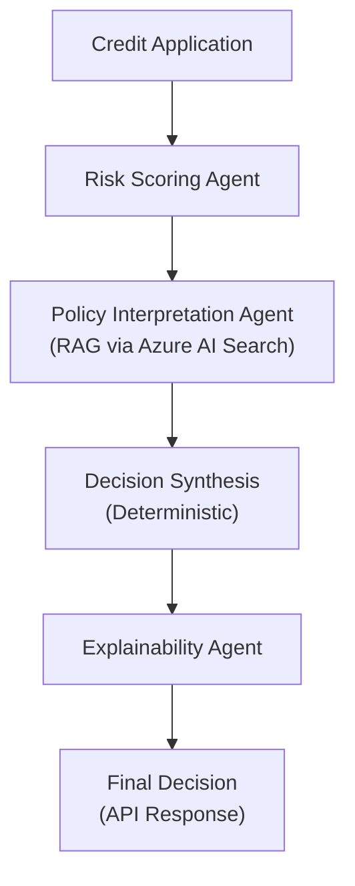
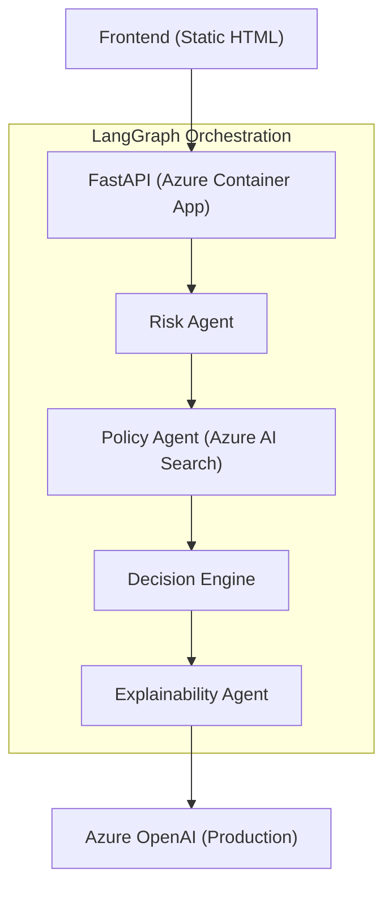

# Azure Credit Risk Decisioning Agent

> **Production-grade agentic AI system for credit risk evaluation, built with LangGraph and deployed on Azure.**

This project demonstrates how to design, build, test, and deploy a real-world BFSI decisioning system using modern agentic AI patterns — not a toy demo.

---

## 🚩 Problem Statement

Traditional credit decision systems suffer from three major issues:
1. **Opaque decisions** (no explainability)
2. **Hard-coded rules** that are difficult to update
3. **LLM hallucination risk** when AI is introduced naïvely

In regulated BFSI environments, this is unacceptable.

### Goal
Build a production-ready, auditable, agentic AI system that:
*   ✅ Evaluates credit applications
*   ✅ Grounds decisions in real policy documents
*   ✅ Enforces deterministic decision boundaries
*   ✅ Supports human-in-the-loop approvals
*   ✅ Runs reliably in Azure

---

## 🧠 System Overview

This system evaluates a credit application by orchestrating multiple specialized agents using **LangGraph** as the control plane.

### High-Level Flow



---

## 🤖 Agent Responsibilities

| Agent | Responsibilities | Key Characteristics |
| :--- | :--- | :--- |
| **1. Risk Scoring Agent** | • Assesses applicant risk based on income, EMI, credit score, and loan parameters.<br>• Produces a risk band + factors. | Uses an LLM only for **bounded reasoning**, never for final authority. |
| **2. Policy Interpretation Agent** (RAG) | • Retrieves live credit policies from Azure AI Search.<br>• Interprets policies relevant to the application. | Explicitly separates retrieval from reasoning. **Prevents hallucinations** by grounding all decisions in retrieved text. |
| **3. Decision Synthesis** | • Applies hard business rules.<br>• Produces final recommendation: `APPROVE`, `CONDITIONAL`, `REJECT`.<br>• Determines if manual review is needed. | **Deterministic.** No LLM is allowed in this step. |
| **4. Explainability Agent** | • Converts structured decision data into an auditor-friendly explanation. | Ensures explainability **without altering decision logic**. |

### 🧩 Why LangGraph?
LangGraph is used as the system control plane, not just an agent executor. This ensures:
*   Deterministic execution order
*   Explicit state transitions
*   Auditable decision flow
*   Safe failure handling

---

## 📚 RAG Design (Azure AI Search)

Credit policies are stored in **Azure AI Search**. They are ingested once and updated independently of the code.

**At Runtime:**
1.  Relevant policy clauses are retrieved.
2.  LLMs only interpret retrieved text.
3.  **The model cannot invent rules.**

> This mirrors how real BFSI systems handle policy-driven decisions.

---

## 🏗️ Architecture



### ☁️ Azure Stack

| Component | Azure Service |
| :--- | :--- |
| **API Hosting** | Azure Container Apps |
| **LLM (Prod)** | Azure OpenAI |
| **RAG Store** | Azure AI Search |
| **Logging** | Azure Log Analytics |
| **CI/CD** | GitHub Actions |
| **Container Registry** | Azure Container Registry |

**Why Azure Container Apps?**
*   Stateless AI microservice
*   Built-in autoscaling
*   Managed ingress
*   Matches real internal AI deployments (avoiding complexity of AKS for single-service workloads)

---

## 🧪 Testing Strategy

This project uses execution modes to ensure correctness and stability across environments.

| Environment | LLM Used | Purpose |
| :--- | :--- | :--- |
| **Local Dev** | Ollama | Real reasoning during development. |
| **CI** | FakeLLM | **Deterministic tests.** CI never depends on local models or cloud APIs. |
| **Azure Prod** | Azure OpenAI | Live inference in production. |

---

## 🔐 Safety & Governance

*   **Strict Pydantic contracts** for all inputs/outputs.
*   **Centralized error handling** to prevent crashes.
*   **Measurement:** No partial decisions on failure.
*   **Security:** No stack traces leaked to clients.
*   **Human-in-the-loop:** Explicit flags for manual review.
*   **Observability:** Structured logging ready for Azure Log Analytics.

---

## 🚀 Deployment

### Local
```bash
docker build -t credit-ai-service .
docker run -p 8000:8000 credit-ai-service
```

### Azure (Automated)
1.  **GitHub Actions CI** validates tests.
2.  **CD Pipeline** builds the Docker image.
3.  Image is pushed to **Azure Container Registry**.
4.  Service is deployed to **Azure Container Apps** with checks enabled.

---

## 📈 What This Project Demonstrates

This is **not a demo chatbot**. It demonstrates the ability to:
*   Design agentic AI systems responsibly.
*   Apply LLMs where appropriate — and **restrict them where not**.
*   Build RAG systems with real, dynamic data sources.
*   Deploy scalable AI services in Azure.
*   Implement CI/CD patterns specifically for AI workloads.
*   **Think like an AI engineer, not just a prompt engineer.**

---

## 📊 Benchmarks

| Metric | Before Optimization | After Optimization | Improvement |
|------|---------------------|-------------------|------------|
| Avg Latency (s) | 180.13 | 8.97 | ↓ 95.0% |
| Max Latency (s) | 189.15 | 9.70 | ↓ 94.9% |
| Total Tokens / Request | ~9,074 | ~2,109 | ↓ 76.8% |
| Avg.Cost / Request (USD) | ~$0.0089 | ~$0.0023 | ↓ 74.1% |
| Failure Rate | 0% | 0% | N/A |

---

### Why the improvements?

- Token budgets enforce deterministic outputs
- Model selection aligns reasoning vs structured tasks
- RAG context truncation reduces prompt size
- Schema-enforced JSON eliminates parsing failures

---

## 📈 Evaluation Metrics

This system tracks:
- Decision quality consistency
- RAG effectiveness
- Agent reliability
- Cost & latency efficiency

Metrics are collected per-request and aggregated for analysis.

---

### 👤 Author

**Nidish M**
*AI / ML Engineer*
*Focus: Agentic AI systems, Azure-native deployment, BFSI use cases*